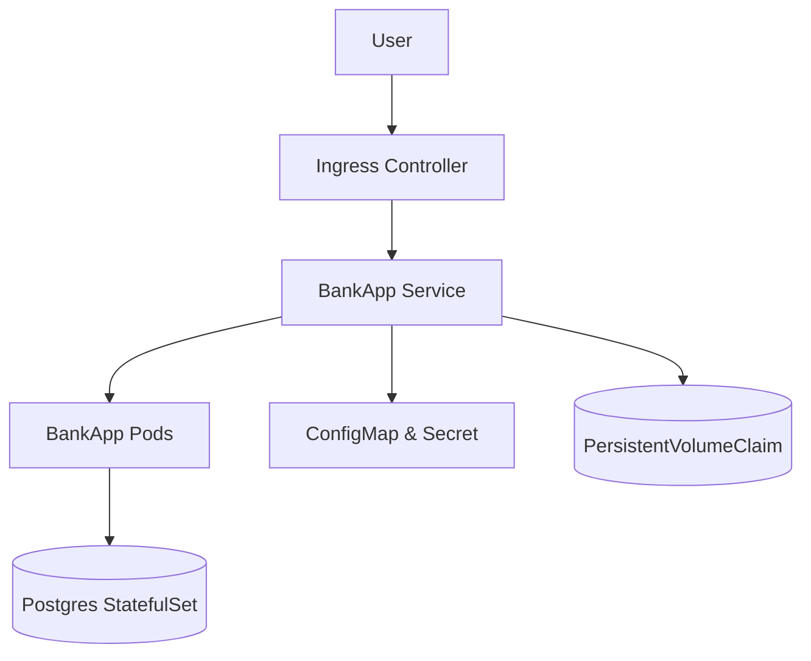

# 🚀 Week 6 — Kubernetes Basics & Advanced Challenges 🧩

### Learning Kubernetes the Real-World Way

This week I deep-dived into Kubernetes — not just “how to deploy,” but *why each component matters* in real-world production clusters.
Through the **SpringBoot BankApp** challenge, I learned how modern DevOps teams design resilient, scalable, and secure microservices platforms.

---

## 📘 Executive Summary

The Kubernetes week challenged me to go beyond theory — I built, deployed, and secured real microservices using Kubernetes fundamentals and advanced patterns.
Each manifest I created mapped directly to real-world DevOps operations: scaling, storage, secrets, RBAC, and observability.
By the end, I had a production-grade deployment flow ready to extend into my own projects.

---

## 🧠 What I Learned

### ⚙️ Kubernetes Architecture

* Understood how the **Control Plane** (API Server, Scheduler, Controller Manager, etcd) and **Worker Nodes** (kubelet, kube-proxy, container runtime) coordinate cluster state.
* Learned the flow of a Pod lifecycle — from `kubectl apply` to scheduling on a node.

### 📦 Core Objects & Workloads

* **Pod**, **ReplicaSet**, **Deployment**, **StatefulSet**, and **DaemonSet** — each has a clear purpose in ensuring high availability and workload persistence.
* Practiced blue-green rollouts and rollback scenarios.

### 🌐 Networking & Ingress

* Deployed **ClusterIP**, **NodePort**, and **LoadBalancer** Services.
* Configured **Ingress** for external routing and added **NetworkPolicies** to enforce zero-trust networking.

### 💾 Storage Management

* Created **PersistentVolumes**, **PersistentVolumeClaims**, and **StorageClasses** for both static and dynamic provisioning.
* Learned how databases like PostgreSQL use **StatefulSets** for persistent identity and storage.

### 🔐 Configurations & Secrets

* Mounted **ConfigMaps** and **Secrets** as environment variables and volumes.
* Understood best practices — RBAC, encryption at rest, and external secret stores (Vault/AWS Secrets Manager).

### 📈 Autoscaling & Resource Optimization

* Implemented **Horizontal Pod Autoscaler** (HPA) and explored **Vertical Pod Autoscaler** (VPA).
* Gained clarity on metrics server requirements and scaling based on CPU utilization.

### 🛡️ Security & RBAC

* Built **Role**, **RoleBinding**, and **ServiceAccounts** to apply the principle of least privilege.
* Used **Taints**, **Tolerations**, and **Pod Disruption Budgets** to protect critical workloads.

### ⏰ Job Scheduling & CRDs

* Automated tasks with **Jobs** and **CronJobs**.
* Extended Kubernetes API using a **Custom Resource Definition (CRD)** for backup operations.

### 🧩 Helm & Advanced Deployments

* Created a full **Helm Chart** for the application — parameterized values, templated manifests, and managed rollouts with a single command.
* Understood how Helm simplifies CI/CD pipelines and versioned deployments.

---

## 🗺️ Architecture Overview

> **Flow:** Traffic hits the NGINX Ingress → routed to SpringBoot BankApp pods → persistent data via StatefulSet (Postgres) → secured configs via ConfigMap & Secret.

---

## 🧰 Hands-On Highlights

* 🧩 Deployed `bankapp` via Deployment, exposed with Ingress, scaled using HPA.
* 🗄️ Deployed `Postgres` as a StatefulSet with persistent volume claim.
* 🔒 Implemented RBAC roles (admin/developer/tester) to simulate real-world access.
* ⚙️ Deployed DaemonSet for node-level monitoring simulation.
* ☸️ Created Helm chart for automated, parameterized deployment.
* 🕓 Configured CronJob for scheduled tasks and a CRD for backups.

---

## 🧑‍💻 Connecting It To My Projects

### 🌊 **NeptuneStack**

> *A DevSecOps Dashboard integrating CI/CD, observability, and security pipelines.*

🔗 [View NeptuneStack on GitHub](https://github.com/gauravchile/NeptuneStack)

* Kubernetes manifests from this challenge directly inspired NeptuneStack’s **Helm-based multi-service deployment pattern**.
* Adopted RBAC and namespace isolation principles learned here to separate Dev, QA, and Prod environments.

### 🎬 **Streamflix**

> *A containerized microservice app for media streaming.*

🔗 [View Streamflix on GitHub](https://github.com/gauravchile/Streamflix)

* Applied **StatefulSet + PVC** concepts for persistent media storage.
* Leveraged **HPA** from this week to auto-scale transcoding pods under heavy streaming load.

### ☁️ **EKS WebApp Deployment**

> *An AWS EKS-based web application pipeline.*

🔗 [View EKSWebAppDeployment on GitHub](https://github.com/gauravchile/EKSWebAppDeployment)

* Used knowledge of **LoadBalancer Service**, **Ingress Controller**, and **StorageClass (EBS CSI)** for production-ready deployments.
* Combined **Helm Charts + GitHub Actions + EKS** for automated rolling updates.

---

## 🔐 Security & Best Practices

* Enforced least privilege with **Kubernetes RBAC**
* Implemented **NetworkPolicy** for restricted ingress
* Used **ConfigMaps/Secrets** instead of hard-coded configs
* Set **resource requests/limits** for each container
* Added **PodDisruptionBudget** for HA during upgrades
* Applied **Taints/Tolerations** to isolate critical workloads
* Planned encryption at rest for secrets and persistent data

---

## 🔑 Key Takeaways

| Area          | What I Gained                                                   |
| ------------- | --------------------------------------------------------------- |
| Architecture  | End-to-end understanding of Kubernetes’ control and data planes |
| Networking    | Secure internal/external connectivity via Services & Ingress    |
| Storage       | Dynamic provisioning → real-world persistence                   |
| Scaling       | Reactive autoscaling using metrics & load                       |
| Security      | RBAC, PDB, Taints = controlled, resilient cluster               |
| Extensibility | Helm & CRDs → customizable, reusable deployments                |

---

## 📊 Command Cheat Sheet

| Action                | Command                                                                                     |
| --------------------- | ------------------------------------------------------------------------------------------- |
| Apply all manifests   | `kubectl apply -f k8s/ --recursive`                                                         |
| Check pods & services | `kubectl get all -n bankapp`                                                                |
| Verify ingress        | `curl -I http://bankapp.local`                                                              |
| Restart deployment    | `kubectl rollout restart deploy/bankapp -n bankapp`                                         |
| Watch autoscaling     | `kubectl get hpa -w -n bankapp`                                                             |
| Test RBAC             | `kubectl auth can-i delete pods --as=system:serviceaccount:bankapp:developer-sa -n bankapp` |

---

## 📸 Evidence of Work

> These outputs confirm working deployments, networking, autoscaling, and access control.

---

## 🌟 Reflection

This week shifted my mindset from “running containers” to **“orchestrating scalable systems.”**
Kubernetes isn’t just about YAML — it’s about **reliability, repeatability, and resilience**.

Next, I’ll integrate these learnings into **NeptuneStack’s EKS Helm Pipeline**, ensuring production-grade observability and security automation.

---

## 🧩 Advanced Learning (Next Steps)

* Integrate **Prometheus + Grafana** for observability
* Implement **Istio** or **Linkerd** for service mesh and traffic control
* Explore **Kustomize** for environment overlays
* Automate **Canary Deployments** in Jenkins
* Deploy **NeptuneStack** fully on **EKS with Helm and RBAC**

---

## 💬 Interview Q&A Appendix

**Q1:** How does a Deployment maintain desired state?
🅰️ The Controller reconciles ReplicaSets and Pods with the Deployment spec, automatically creating or terminating Pods to match desired state.

**Q2:** Difference between Deployment, StatefulSet, and DaemonSet?
🅰️ Deployment = stateless rollouts, StatefulSet = stable identity/storage, DaemonSet = one Pod per node for background jobs.

**Q3:** How do NodePort and LoadBalancer differ?
🅰️ NodePort exposes service on each node’s IP at a static port; LoadBalancer provisions a cloud LB and routes external traffic.

**Q4:** How does the HPA scale Pods?
🅰️ It reads metrics (CPU/Mem), compares them with target utilization, and adjusts replicas dynamically via the Deployment controller.

**Q5:** Why are ConfigMaps and Secrets separated?
🅰️ ConfigMaps store non-sensitive configuration, Secrets store sensitive data; Secrets can be encrypted at rest and base64-encoded for confidentiality.

**Q6:** What’s the purpose of Pod Disruption Budget?
🅰️ It prevents all Pods in a workload from being disrupted simultaneously during voluntary operations like node upgrades.

**Q7:** What’s the role of RBAC in a multi-team cluster?
🅰️ It ensures each team or service account only accesses the resources and verbs needed, minimizing blast radius and misconfiguration risk.

---

